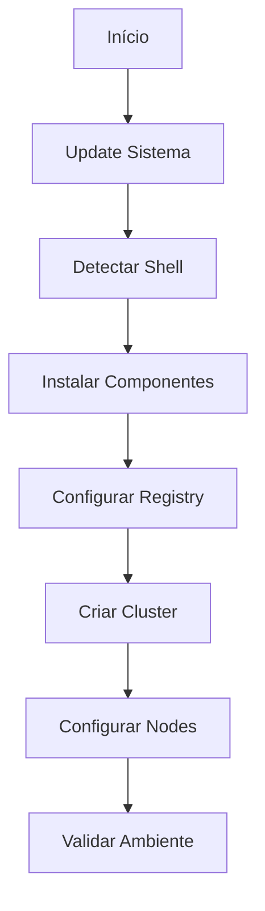

# Script de Automação do Ambiente

## Sobre o Script

O script `setup-ambiente.sh` automatiza a instalação e configuração de todo o ambiente necessário para desenvolvimento de Operators.

## Funcionalidades

1. Instalação de Componentes
   - Go toolchain e ambiente
   - Docker Engine
   - Kind e registry local
   - Ferramentas de desenvolvimento

2. Configuração de Ambiente
   - Registry local integrado com Kind
   - Cluster Kubernetes configurado
   - Permissões e variáveis de ambiente

3. Validação e Logging
   - Verificação de cada etapa
   - Logs coloridos e timestamps
   - Tratamento de erros

## Estrutura do Script



## Uso do Script

1. Download:

```bash
curl -O https://raw.githubusercontent.com/fmnapoli/kubernetes-operators-training/main/scripts/setup-ambiente.sh
chmod +x setup-ambiente.sh
```

2. Execução:

```bash
./setup-ambiente.sh
```

3. Variáveis Configuráveis:

```bash
REG_NAME='kind-registry'    # Nome do registry
REG_PORT='5001'            # Porta do registry
CLUSTER_NAME='k8s-operators-lab'  # Nome do cluster
```

## Logs e Debugging

O script usa cores para diferentes tipos de log:

- 🔵 INFO: Informações gerais
- 🟢 SUCESSO: Operação concluída
- 🟡 AVISO: Atenção necessária
- 🔴 ERRO: Falha na operação

Exemplo de saída:

```
[2024-01-07 10:15:30] [INFO] Iniciando setup do ambiente...
[2024-01-07 10:15:35] [SUCESSO] Go instalado
[2024-01-07 10:15:40] [AVISO] Shell não suportado: fish
```

## Troubleshooting

1. Porta em uso:

```bash
sudo lsof -i :5001  # Verificar processo usando a porta
sudo kill -9 PID    # Matar processo se necessário
```

2. Docker sem permissão:

```bash
sudo usermod -aG docker $USER
newgrp docker
```

3. Registry não conectado:

```bash
docker network connect kind kind-registry
```

## Limpeza

Para remover ambiente:

```bash
kind delete cluster --name k8s-operators-lab
docker rm -f kind-registry
```
