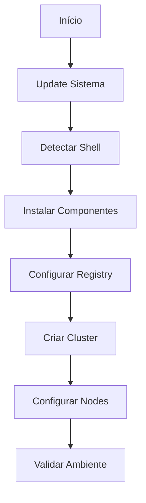

# Script de Automação do Ambiente

## Visão Geral

O script [setup-ambiente.sh](scripts/setup-ambiente.sh) automatiza a instalação e configuração do ambiente de desenvolvimento Kubernetes.

## Funcionalidades

### Instalação de Componentes

- Go toolchain e ambiente
- Docker Engine
- Kind e registry local
- Ferramentas de desenvolvimento

### Configuração de Ambiente

- Registry local integrado com Kind
- Cluster Kubernetes configurado
- Permissões e variáveis de ambiente

### Validação e Logging

- Verificação de cada etapa
- Logs coloridos e timestamps
- Tratamento de erros

## Fluxo de Execução



## Uso

### Download e Instalação

```bash
curl -O https://raw.githubusercontent.com/fmnapoli/kubernetes-operators-training/main/scripts/setup-ambiente.sh
chmod +x setup-ambiente.sh
```

### Execução

```bash
./setup-ambiente.sh
```

### Variáveis Configuráveis

```bash
REG_NAME='kind-registry'    # Nome do registry
REG_PORT='5001'            # Porta do registry
CLUSTER_NAME='k8s-operators-lab'  # Nome do cluster
```

## Logs e Debug

### Níveis de Log

- INFO (🔵): Informações gerais
- SUCESSO (🟢): Operação concluída
- AVISO (🟡): Atenção necessária  
- ERRO (🔴): Falha na operação

### Exemplo de Saída

```bash
[2024-01-07 10:15:30] [INFO] Iniciando setup do ambiente...
[2024-01-07 10:15:35] [SUCESSO] Go instalado
[2024-01-07 10:15:40] [AVISO] Shell não suportado: fish
```

### Solução de Problemas

#### Porta em Uso

```bash
sudo lsof -i :5001  # Verificar processo usando a porta
sudo kill -9 PID    # Matar processo se necessário
```

#### Docker sem Permissão

```bash
sudo usermod -aG docker $USER
newgrp docker
```

#### Registry não Conectado

```bash
docker network connect kind kind-registry
```

## Limpeza

### Remoção do Ambiente

```bash
# Remove cluster Kind
kind delete cluster --name k8s-operators-lab

# Remove registry local
docker rm -f kind-registry
```
