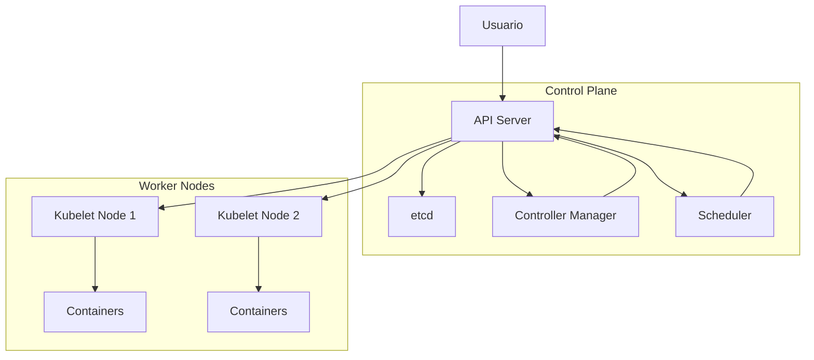

# Introdução ao Kubernetes

## Objetivos de Aprendizado

- Compreender a arquitetura Kubernetes e seus componentes principais
- Entender o funcionamento da API Kubernetes
- Aprender a interagir com o cluster usando kubectl e chamadas API diretas
- Criar e gerenciar recursos básicos Kubernetes

## Pré-requisitos

- Conhecimento básico de containers e Docker
- Familiaridade com linha de comando Linux
- Compreensão básica de APIs REST
- Go instalado (versão 1.16+)

## Arquitetura Kubernetes

### Componentes Principais

1. **Control Plane**
   - API Server: Ponto central de comunicação
   - etcd: Banco de dados distribuído
   - Controller Manager: Executa controladores
   - Scheduler: Distribui pods nos nodes

2. **Worker Nodes**
   - Kubelet: Agente em cada node
   - Container Runtime: Docker/containerd
   - Kube-proxy: Networking
