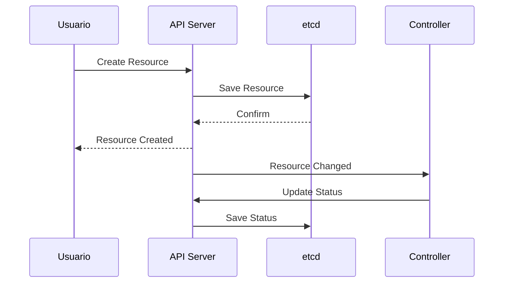
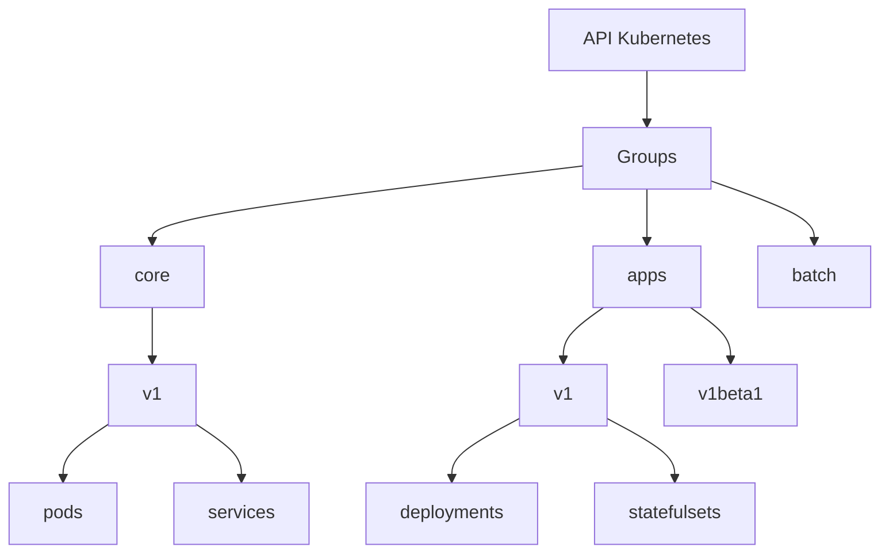

# API Kubernetes

## Fluxo de Comunicação



## Estrutura da API



A API Kubernetes é organizada em:

1. **Groups**: Conjuntos lógicos de recursos
   - core (v1)
   - apps
   - batch
   - networking.k8s.io

2. **Versions**: Níveis de estabilidade
   - v1: estável
   - v1beta1: beta
   - v1alpha1: alpha

3. **Resources**: Tipos de objetos
   - pods
   - deployments
   - services
   - configmaps

### URLs da API

Formato padrão:

```bash
/apis/{group}/{version}/namespaces/{namespace}/{resource}
```

Exemplos:

- `/api/v1/namespaces/default/pods`
- `/apis/apps/v1/namespaces/default/deployments`
- `/apis/networking.k8s.io/v1/namespaces/default/ingresses`
